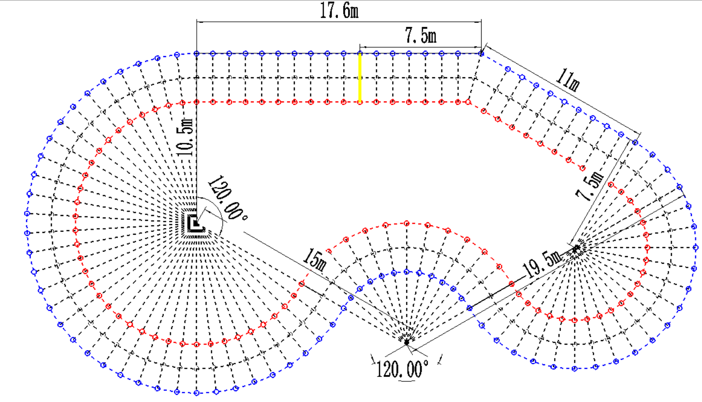
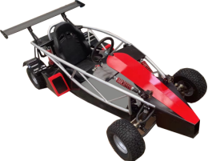
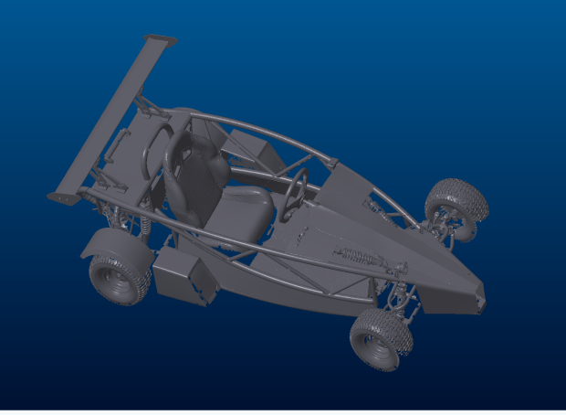
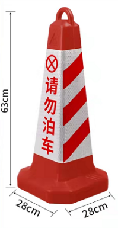
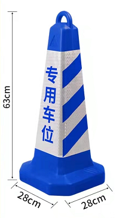
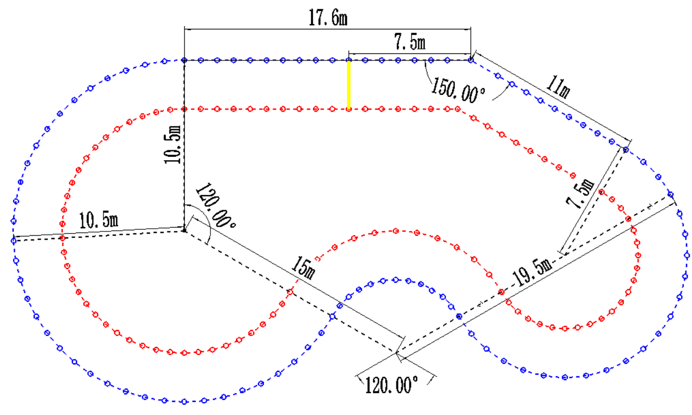

**第十八届全国大学生智能汽车竞赛**

> 室外智能驾驶挑战赛
>
> 比赛规则

**一、背景**

**1.1 赛事背景**

随着新一轮科技革命和产业变革的兴起,智能汽车已成为未来汽车产业的发展战略方向。2020年2月，国家发改委、科技部、工信部等11个部门联合印发《智能汽车创新发展战略》，提出到2025年，中国标准智能汽车的技术创新、产业生态、基础设施、法规标准、产品监管和网络安全体系基本形成。同时，实现有条件自动驾驶的智能汽车达到规模化生产，实现高度自动驾驶的智能汽车在特定环境下市场化应用。

无人驾驶技术作为智能汽车的核心技术，涉及智能控制、信息通讯、电子工程、控制理论、传感技术等多领域技术融合，对\"跨学院、跨专业、跨学科\"新时代下的新型复合人才培养提出了更好的要求。

**1.2 赛事目的**

本赛项的设立能够场景化的复现基于无人驾驶的智能车在实际领域中的应用，实现定位导航、计算机视觉、雷达、人工智能、自动控制和电机控制等多种技术融合的场景。通过比赛，期望达到以赛促教，进一步深化产学融合，拓宽高校人工智能及机器人相关专业的教学内容，提升高校人工智能及机器人科技创新能力和人才培养能力。

赛项包含对智能车的智能控制技术、机器视觉技术、电子电路技术、机器人操作系统ROS应用、激光雷达及深度摄像机等新型传感器应用、SLAM、路径规划、自主导航等多项先进技术，提前让学生熟悉企业所用的技术，从而提升学生就业能力。并且比赛考核内容与相关课程的教学内容紧密结合，提高学生对移动机器人的设计、控制及应用能力。

2.  **比赛内容**

    **2.1 赛题内容**

    [比赛总分值100分，其中智能车运行成绩占85分，技术报告分值10分，车队宣传分值5分；具体规则如下：]{.mark}

    智能车在未知赛道运行4圈，分别完成人工驾驶和自主驾驶两个任务。前2圈需要驾驶员人工驾驶用来识别赛道构建地图，后2圈，驾驶员离开驾驶室，智能车需自主行驶完后面2圈赛道；

    智能车可切换人工驾驶和无人驾驶两种模式；比赛开始时，智能车在人工驾驶状态下沿着赛道运行2圈，完成对未知赛道的探索，为后面自主驾驶做铺垫；

    完成人工驾驶的2圈任务后，驾驶员需要把智能车切换到无人驾驶状态，离开驾驶室，智能车自主行驶完成剩余2圈的比赛任务，无人驾驶运行期间不允许参赛队员触碰方向盘，禁止人工驾驶。

    比赛分为[标准]{.mark}组和自制组两部分：

    标准组[使用]{.mark}大赛组委会统一指定的标准智能车参赛；

    自制组利用组委会统一指定的[控制套件为基础制作智能车；为降低参赛门槛组委会开源标准组智能车的机械图纸以及制作方案，供参赛队员参考和改进。]{.mark}

    [自制组参赛同学需要参考图纸制作智能车的机械和外观结构，利用控制套件，做出一台可以同时支持人工驾驶和无人驾驶的智能车参加比赛；]{.mark}两组单独进行评分，互不干扰。

    由于两组任务难度有差别，标准组和自制组会分开进行评比。

    **2.1.1 比赛赛道**

    比赛场地为不规则环形场地，由红蓝两色锥桶搭建而成，整体赛道由直线区域、"S"弯、直角区域、圆形区域等部分元素或全部元素构成，具体特征如下：

    搭建道的转弯半径不小于2m；

    赛道宽度为3m\~5m；

    同侧相邻锥桶最小间隔为1m；

    锥桶间距小于赛道宽度；

    赛道由内圈红色锥桶和外圈蓝色锥桶构成；

    赛道环形周长为100\~200m；

{width="6.074305555555555in"
height="3.4805555555555556in"}

[图 1 赛道示意图]{.mark}

以上赛道为示意图，具体赛道尺寸赛前公布。赛道搭建注意事项如下：

(1)各弧度或直线区域锥桶需均匀摆放(折角处除外)，具体摆放位置参考图1；

(2)图中虚线[只为描述锥桶之间相对摆放位置]{.mark}，真实赛道中无虚线痕迹；

(3)折角顶点处会有一个锥桶，两侧锥筒一一对应；

(4)比赛时智能车需要沿着赛道逆时针运行；

(5)黄线为发车线。

**2.2 技术报告撰写**

技术报告总分值10分。技术报告撰写内容参考技术报告模板，具体撰写要求请参考技术报告模板。

**[2.3 车队宣传任务]{.mark}**

[车队宣传总分值为5分。]{.mark}

[为增加参赛队凝聚力、保持车队的传承和车队文化建设，方便后续车队招人，建议参加该赛项的参赛队，组建车队的新媒体平台（公众号、B站或抖音等）进行车队宣传；车队名称需要认真重视，不能过于随意，建议常年保持一致。正式比赛前，参赛队需要整理收集车队的宣传内容和素材与技术报告，一并提交到组委会邮箱，作为参赛作品的一部分。]{.mark}

**2.4 比赛评分说明**

**2.4.1 比赛评分规则**

考虑到比赛需要运行4圈，前2圈为有人驾驶，后2圈为无人驾驶，两段行程分别计时；期望后2圈运行的速度要超过前2圈，所以后2圈的成绩权重高于前2圈，具体比赛的有效时间计算公式为：

有效时间T = 前2圈耗时\*30% + 后2圈耗时\*70% + 加罚时间

$视频得分\  = \ \frac{{(T_{\max} - T_{有效})}^{2}}{{(T_{\max} - T_{\min})}^{2}}$\*85

Tmax：比赛中完赛用时最长的队伍的有效时间(s)

Tmin：比赛中完赛用时最短的队

$T_{有效}$：当前队伍有效时间(s)

**2.4.2 关于比赛加罚时间的处理细则**

> \(1\)
> 智能车每次撞击锥桶加罚5s；如果智能车没撞到锥桶只是路过锥桶时压到了锥桶的支撑边角，则不加罚；
>
> \(2\)
> 如果智能车偏离轨道运行，每绕错一个锥桶加罚20s，如果绕错的锥桶数量累计多于3个或20s内未返回正确轨道，则计比赛失败；
>
> \(3\) 智能车在赛道中停止运行超过20s，则计比赛失败；
>
> \(4\) 驾驶员切换无人驾驶后,需要离开驾驶室,未离开驾驶室视为比赛失败；
>
> \(5\)
> 驾驶员需在第二圈结束后，立刻下车切换无人驾驶模式，切换后举双手示意裁判；若切换无人驾驶状态后，未示意裁判则后2圈运行时间加罚20s；
>
> (6)若后2圈为键盘或手柄控制移动，则后2圈运行时间加罚40s；若后两圈为自主移动，则不加罚。

**三、参赛要求**

**3.1 参赛队伍要求**

参赛学生要求：仅限全日制在校专科生、本科生、研究生；

队伍人数要求：每队参赛人数限10名，指导教师1\~2名。

**3.2 参赛设备改装及性能要求**

为保证大赛的公平，避免参赛队因为设备的性能差异导致的不公平，大赛组委会统一指定标准参赛平台，供应商为北京小豚科技有限公司。

为激发参赛队伍的创新实践能力，大赛允许参赛队员在[标准参赛平台基础上]{.mark}进行改装，除了主控、雷达、电池不能替换外，允许参赛队增加视觉或其他传感器，允许参赛队对车体结构或外观进行改造。

{width="2.3784722222222223in"
height="1.8388888888888888in"}

[标准参赛平台示意图]{.mark}

除此之外，参赛队也可以[自制设备参赛，自制设备的要求控制套件为]{.mark}组委会统一指定标准参赛系统，[自制车体的底盘需要根据组委会提供的图纸自行制作，底盘上会预留螺丝固定接口；底盘以上]{.mark}机械结构提供开源图纸作为参考，参赛队可参考制作或进行设计优化。

{width="2.8159722222222223in"
height="2.064583333333333in"}

开源三维结构图

智能车开源图纸及控制套件介绍下载地址：

链接：https://pan.baidu.com/s/1L0PQ_q5pYW6fjYOgPi8hTA

提取码：25um

**标准组需要参赛队做的工作：**

1、传感器数据获取及应用

2、无人驾驶算法调试及优化

3、适配、测试及应用可能需要的其他传感器

**自制组需要参赛队做的工作：**

1、智能车底盘加工制作（提供开源图纸）

2、智能车外观结构设计及制作（提供开源图纸）

3、智能车整体组装和调试

4、控制套件的学习及应用（提供学习手册）

5、无人驾驶算法的调试及优化

6、适配、测试及应用可能需要的其他传感器**3.3 障碍物**

比赛赛道是有红色锥桶和蓝色锥桶搭建而成，赛道中的锥桶需要去掉白色的反光膜。可利用锥桶颜色来识别无人车运行方向。

名称：锥桶

材质：塑料

规格：630\*280\*280mm

外皮颜色：红色 、蓝色

{width="0.90625in"
height="1.7479166666666666in"}{width="0.9645833333333333in"
height="1.8159722222222223in"} **3.4 线下赛提交资料要求：**

线下赛除了现场比赛外，还需要额外提交的作品为：源码+技术手册+车队宣传内容；

比赛前，参赛队员需要将整理好的技术手册及视频以压缩包的形式提交至**smartcarX@163.com**邮箱，每队只限提交一次，提交作品的邮件需要按如下格式统一邮件标题名称：

格式为：室外智能驾驶挑战赛+学校名称+首位指导老师姓名+首位参赛队员姓名+队伍名称；

例如：室外智能驾驶挑战赛_北京理工学校_张鑫_王帅_北速组。

附件为一个压缩文件夹，文件夹内包含技术手册、录制视频、源程序文件、车队宣传内容；具体如下：

\|------室外智能驾驶挑战赛\_\*\*\*学校\_\*\*老师\_\*\*队员\_\*\*队（文件夹名称同邮件主题名称）

\|------室外智能驾驶挑战赛\_\*\*\*学校\_\*\*老师\_\*\*队员\_\*\*队_技术手册.pdf

\|------室外智能驾驶挑战赛\_\*\*\*学校\_\*\*老师\_\*\*队员\_\*\*队_源程序文件

\|------室外智能驾驶挑战赛\_\*\*\*学校\_\*\*老师\_\*\*队员\_\*\*队_车队宣传内容.zip

比赛结束后，大赛组委会根据比赛成绩及技术手册成绩进行汇总整理并公布比赛成绩。

**3.5 线上赛提交注意事项：**

若无法举办线下赛，则改为线上提交作品参赛，具体要求如下：

线上赛提交的作品为：

参赛视频（3个不同是视角的运行视频+赛道测量视频）+技术报告+源码+车队宣传内容。

**3.5.1录制视频要求**

1、参赛队员录制比赛视频参赛，采用三机位不同角度录制参赛视频。

1）采用三机位录制视频展示：

1号机位固定在[智能车上]{.mark}，视角要清晰的显示[前方路面运行情况]{.mark}。

[2号机位固定在智能车上，]{.mark}视角要清晰驾驶员的操控动作和方向盘的使用情况。

3号机位展示赛道整体画面。该机位建议为无人机航拍或固定机位。

2）禁止使用遥控器控制；

2、除了录制参赛的运行视频外，还需要录制一段测量视频，按照比赛规则对赛道关键信息和元素进行实际测量，以保证比赛赛道的统一性和规范性，测试视频可以单独进行测量录制。

展示赛道摆放时需注意,展示赛道宽度，各弧度区域的半径长度，直线区域长度，具体如下图所示：

{width="5.309722222222222in"
height="3.1881944444444446in"}

图2 具体测量数据示意图

**3.5.2 提交资料要求**

比赛前，参赛队员将整理好的技术手册及视频以压缩包的形式提交至
**smartcarX@163.com**邮箱，每队只限提交一次。

邮件标题命名方式为：室外智能驾驶挑战赛+学校名称+指导老师姓名+队伍名称；

邮件附件为一个压缩文件夹，文件夹内包含技术手册、录制视频和源文件，命名方式如下：

\|------室外智能驾驶挑战赛\_\*\*\*学校\_\*\*老师\_\*\*队员\_\*\*队（文件夹名称同邮件标题名称）

\|------室外智能驾驶挑战赛\_\*\*\*学校\_\*\*老师\_\*\*队员\_\*\*队_技术手册.pdf

\|------室外智能驾驶挑战赛\_\*\*\*学校\_\*\*老师\_\*\*队员\_\*\*队_1号机.mp4

\|------室外智能驾驶挑战赛\_\*\*\*学校\_\*\*老师\_\*\*队员\_\*\*队_2号机.mp4

\|------室外智能驾驶挑战赛\_\*\*\*学校\_\*\*老师\_\*\*队员\_\*\*队_3号机.mp4

\|------室外智能驾驶挑战赛\_\*\*\*学校\_\*\*老师\_\*\*队员\_\*\*队_赛道测量视频.mp4

\|------室外智能驾驶挑战赛\_\*\*\*学校\_\*\*老师\_\*\*队员\_\*\*队_源程序文件

\|------室外智能驾驶挑战赛\_\*\*\*学校\_\*\*老师\_\*\*队员\_\*\*队_车队宣传内容.zip

比赛结束后，大赛组委会根据比赛成绩及技术手册成绩进行汇总整理并公布比赛成绩。

**3.5.3 视频评分细则**

为保证比赛的严谨性及视频质量，线上赛视频提交内容，在原有2.3
比赛规则及评分说明基础上添加如下处罚细则：

[(1)视频不清晰，未按要求摆放机位的，加罚0～5s。]{.mark}

[(2)视频中比赛赛道按2.1.2比赛赛道搭建，若搭建不符合要求，加罚10\~30s]{.mark}

[(3)比赛场地选择室外合适场地自行搭建，若比赛场地不在室外加罚3s。]{.mark}

[(4)禁止使用工具对比赛视频修改或造假，若出现视频遥控或造假现象，取消比赛资格。]{.mark}

[(5)组委会工作人员会对参赛队提交的资料对无人驾驶状态运行情况进行抽查复现，]{.mark}参赛队需要配合进行复现，若发现不配合或造假现象，取消比赛成绩，若以发放奖状，将予以追回。

**[四、备赛事宜]{.mark}**

**4.1大赛报名**

[大赛报名网址：http://www.smartcar.zone;]{.mark}

**4.2技术报告模板**

[模板下载链接: https://share.weiyun.com/TYlov3NW]{.mark}

**4.3大赛技术交流群**

[为方便参赛同学技术交流和接收比赛相关信息，请参赛队员务必加入官方**QQ交流群：960604900**
,加群时一定要备注学校和姓名，加群后修改群昵称为：学校-姓名，比如：北京理工大学---李华。]{.mark}

**4.4参赛设备部分性能要求**

参赛设备可以使用小豚科技统一提供的标准智能车参赛，也可以自制，自制设备需使用小豚科技统一提供的控制套件；标准智能车及控制套件的部分配置如下：

+----+----------------+-----------------------------------------------+
| 序 | 部件名称       | 参数                                          |
| 号 |                |                                               |
+----+----------------+-----------------------------------------------+
| 1  | [主控]{.mark}  | CPU：[I5 11代]{.mark}                         |
|    |                |                                               |
|    |                | 内存：[8G内存]{.mark}                         |
|    |                |                                               |
|    |                | 硬盘：[SSD 128G]{.mark}                       |
|    |                |                                               |
|    |                | 接口：[4个USB3.0]{.mark}                      |
|    |                |                                               |
|    |                | [无线网卡]{.mark}：[双频]{.mark}              |
+----+----------------+-----------------------------------------------+
| 2  | [电池]{.mark}  | 聚合物锂电池                                  |
|    |                |                                               |
|    |                | 额定电压：[60V]{.mark}                        |
|    |                |                                               |
|    |                | 容量：[20AH]{.mark}                           |
+----+----------------+-----------------------------------------------+
| 3  | [电机]{.mark}  | 18管正弦波电机                                |
|    |                |                                               |
|    |                | [额定功率48～60V 550W]{.mark}                 |
|    |                |                                               |
|    |                | [最大电流：35A]{.mark}                        |
|    |                |                                               |
|    |                | [最大扭矩：19N.M]{.mark}                      |
+----+----------------+-----------------------------------------------+
| 4  | [              | [额定功率]{.mark}：[800W]{.mark}              |
|    | 控制器]{.mark} |                                               |
|    |                | [限流：40A]{.mark}                            |
|    |                |                                               |
|    |                | [欠压范围：41V\~51V；]{.mark}                 |
+----+----------------+-----------------------------------------------+
| 5  | [激            | [角度：360°]{.mark}                           |
|    | 光雷达]{.mark} |                                               |
|    |                | [扫描频率：20HZ，自适应扫描频率]{.mark}       |
|    |                |                                               |
|    |                | [测量频率：10KHZ]{.mark}                      |
|    |                |                                               |
|    |                | [测量范围：25m]{.mark}                        |
|    |                |                                               |
|    |                | [ClaassⅠ激光安全标准(人眼安全)]{.mark}        |
|    |                |                                               |
|    |                | [测量量程解析度0.1%]{.mark}                   |
|    |                |                                               |
|    |                | [A6核ARM 64位处理器，主频高达2GHz             |
|    |                | 2G内存]{.mark}                                |
+----+----------------+-----------------------------------------------+
| 7  | [舵机]{.mark}  | [工作电压：6-8.4V]{.mark}                     |
|    |                |                                               |
|    |                | [扭矩：6-7.4-8.4V对应 58-60-70kg/cm]{.mark}   |
|    |                |                                               |
|    |                | [速度：6-7.4-8.4V对应                         |
|    |                | 0.15-0.14-0.13sec/60°]{.mark}                 |
|    |                |                                               |
|    |                | [角度：180度]{.mark}                          |
|    |                |                                               |
|    |                | [舵机死区设定：4μs;]{.mark}                   |
+----+----------------+-----------------------------------------------+
| 8  | [组            | [GPS模块：]{.mark}                            |
|    | 合导航]{.mark} |                                               |
|    |                | [信号接收模式                                 |
|    |                | ：BDS/GPS/GLONASS/GALIEO/AZSS/SBAS、]{.mark}  |
|    |                |                                               |
|    |                | [定位精度：\<2.5m]{.mark}                     |
|    |                |                                               |
|    |                | [测速精度：\<0.1m/s]{.mark}                   |
|    |                |                                               |
|    |                | [定位更新率：1Hz]{.mark}                      |
|    |                |                                               |
|    |                | [速度：515m/s]{.mark}                         |
|    |                |                                               |
|    |                | [功耗：3.3V 29mA]{.mark}                      |
|    |                |                                               |
|    |                | [工作温度：-40\~85℃]{.mark}                   |
|    |                |                                               |
|    |                | [其它模块：]{.mark}                           |
|    |                |                                               |
|    |                | [电压：5\~36V]{.mark}                         |
|    |                |                                               |
|    |                | [测量维                                       |
|    |                | 度：三轴加速度、三轴陀螺仪、三轴角度]{.mark}  |
|    |                |                                               |
|    |                | [量程：加速                                   |
|    |                | 度：±2g、陀螺仪：±250°/s、角度：±180°]{.mark} |
|    |                |                                               |
|    |                | [角度精度：XY:0.1°、Z轴0.5°]{.mark}           |
|    |                |                                               |
|    |                | [数据接口：串                                 |
|    |                | 口（TTL/232电平、波特率4800\~921600）]{.mark} |
+----+----------------+-----------------------------------------------+
| [9 | [              | [适用电压:48v/60v]{.mark}                     |
| ]{ | 控制器]{.mark} |                                               |
| .m |                | [通用功率:800w]{.mark}                        |
| ar |                |                                               |
| k} |                | [限流:35A]{.mark}                             |
|    |                |                                               |
|    |                | [功率管:15管]{.mark}                          |
|    |                |                                               |
|    |                | [转把电压:0.8V\~3.6V]{.mark}                  |
+----+----------------+-----------------------------------------------+
| [  | [继电          | [供电电压：1 2V]{.mark}                       |
| 10 | 器模组]{.mark} |                                               |
| ]{ |                | [触点：10A250V，带光耦保护]{.mark}            |
| .m |                |                                               |
| ar |                | [驱动电压：5V或3.3V]{.mark}                   |
| k} |                |                                               |
|    |                | [I/O口驱动低电平有效；]{.mark}                |
+----+----------------+-----------------------------------------------+
