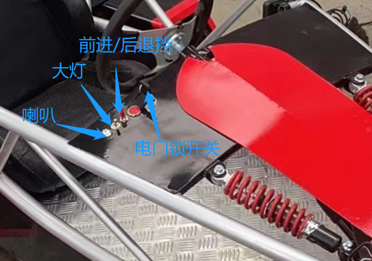

**智能车参考方案介绍**

赛车模型为长220cm，宽112cm
，高80cm，，整体车型为原子头结构，上边搭载了GPS、雷达等多种传感器；

智能车支持无人驾驶和有人驾驶、两种驾驶模式可自由进行切换；采用ROS开发平台，支持激光雷达地图构建、自主导航；可实现静态障碍物与动态障碍物自主路径规划。

关于智能车的操作细节可查阅《电动赛车XT-RC1操作及学习手册》。

**有人驾驶开关介绍**

有人驾驶的控制口如图所示：

{width="3.3631944444444444in"
height="2.359722222222222in"}

左脚为刹车，右脚为油门，银色按钮是喇叭按钮，银色拨动开关是大灯开关，红色拨动开关是为前进后退切换键，电门锁开关用于控制轮子。

**无人驾驶控制箱接口介绍**

下边为控制箱开关按键如图所示：

{width="3.352777777777778in"
height="2.2472222222222222in"}

车体尾部包括电池充电口、急停开关、有人/无人切换按钮、网口、hdmi口、天线口。

**其他外设**

急停开关用于在应急状态下，关闭电机实现制动的效果；有人/无人切换按钮，用于切换有人、无人两种状态；网口、hdmi口、天线与机箱里面控制器相连，用于与外界通信。

除此之外还有其他外设，包括：

前灯：安装在赛车的前边

倒车灯：用于警告后车，前车准备倒车了，安装在赛车的后边

刹车灯：用于警告后车，前车踩刹车了，安装在赛车的后边

喇叭：用于警告周边人，安装在赛车前面

显示器：方便有人驾驶时，驾驶员了解智能车的电量

激光雷达：用于扫描周边环境，获取周边环境信息，一般安于车前边

组合导航：用于获取GPS及陀螺仪数据，方便智能车的控制
